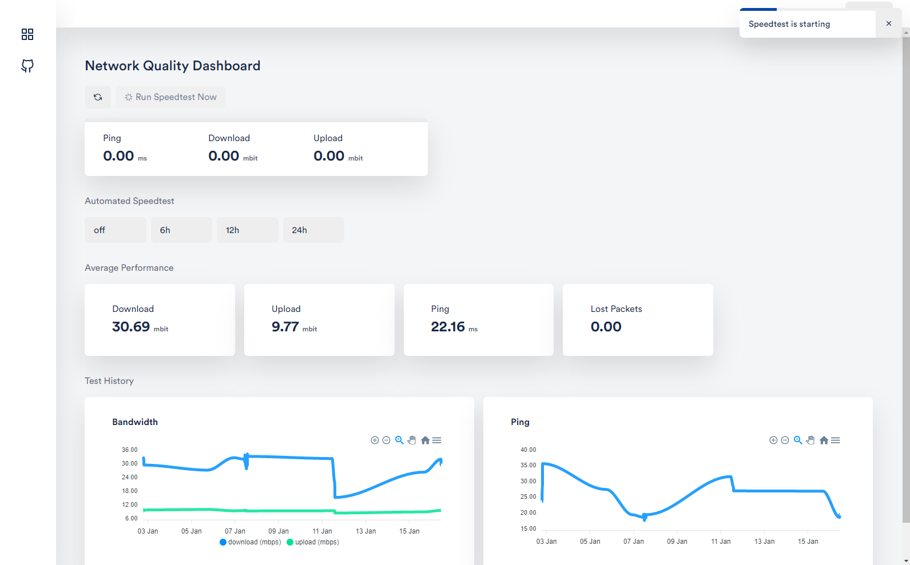

# ISP SpeedTest Logger

If you're on a LTE, 4G, 5G, ... connection, and want to review how (💩) it holds up over time, this should do the trick for you.
This webapp allows you to periodically run speedtests (node.js), store the results (mongodb), and review your network quality in a web ui.

> You can for example throw this container-set on a raspberry pi with docker-host, and leave it running.

## Features

-   Review Network performance over time in UI
-   Configure automated speedtests to run every 24/12/6 hours
-   Easily deploy and run through docker

## Requirements 📦

-   docker + docker-compose installed
-   shared drive in docker
-   host machine should have internet access

## Usage

Admin pw can be set in `.env` -> `ADMIN_PW`

### docker-compose

Run `docker-compose up -d` to build and start all docker containers (db, frontend, api). It will also automatically build frontend and backend on the first startup.

> docker-compose.yml has defaults for environment variables. should you want to use it without docker, create an `.env` file in `./server`, that holds your application config. (rename the example)

### development

During development you might want to run mongodb via docker, but run the api / frontend locally.

Install dependencies first with `npm install`, both in server and client.

You can then run `npm start`, to start the application in dev mode.

Frontend is available on `http://localhost:8080/speedtest`

API can be accessed directly via curl on port 3000 (default).
Use POST `localhost:3000/speedtest` to start a speedtest and log it to mongodb.

